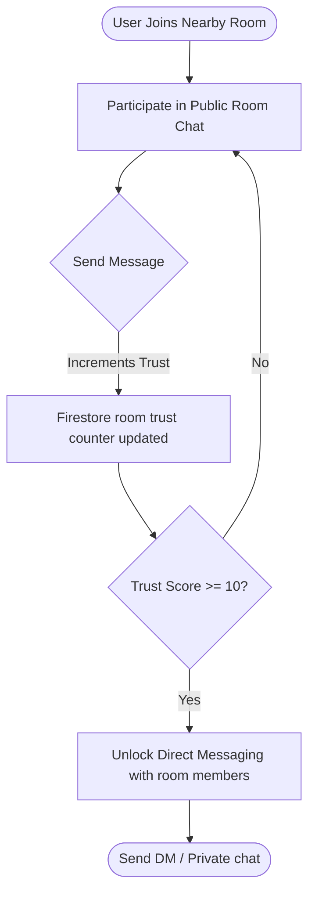

# SpotUs 💥

[](https://reactnative.dev/)
[](https://expo.dev/)
[](https://firebase.google.com/)
[](https://clerk.com/)
[](https://www.nativewind.dev/)
[](https://www.typescriptlang.org/)

**SpotUs** is a next-generation, location-based social discovery and real-time messaging application. Built on React Native and Expo, SpotUs bridges local community discovery with high-integrity social interaction. By leveraging real-time geographic queries, interest-based rooms, and an innovative reputation trust system, SpotUs ensures that local chats remain engaging, safe, and spam-free.

---

## 📖 Table of Contents

- [Core Philosophy & Trust System](#-core-philosophy--trust-system)
- [Key Features](#-key-features)
- [Tech Stack](#%EF%B8%8F-tech-stack)
- [Directory Architecture](#-directory-architecture)
- [Getting Started](#-getting-started)
  - [Prerequisites](#prerequisites)
  - [Environment Variables](#environment-variables)
  - [Local Installation](#local-installation)
  - [Running the App](#running-the-app)
- [Firebase & Security Configuration](#-firebase--security-configuration)
- [Build & Deployment (EAS)](#-build--deployment-eas)
- [Private Repository & License](#-private-repository--license)

---

## 🛡️ Core Philosophy & Trust System

Unlike conventional location-based chat apps that are plagued by cold-reach spam and bots, SpotUs enforces a **Dual Trust System** designed to encourage authentic organic interactions.

### The DM Unlock Flow

To message someone directly:
1. A user joins a local room within their radius.
2. The user participates in the public room chat. Every message sent increments their **Room Trust Score**.
3. Once the user reaches a **Trust Score of 10** or more within that room, the system unlocks the ability to start a Direct Message (DM) thread with other members of that room.



---

## ⚡ Key Features

- 📍 **Geohash Location Queries**: Scans active chat rooms in real-time utilizing geo-queries powered by `geofire-common` and a configurable radius slider.
- 💬 **Real-time Pub/Sub Messaging**: Low-latency chat sync powered by Firebase Firestore, complete with typing indicators and read receipts.
- 🔐 **Secure Passwordless Auth**: Clerk Core integration supporting Passwordless OTP, Google OAuth, and Apple Sign-In.
- 🎨 **Sleek Premium Design**: Crafted using NativeWind (Tailwind CSS v3) supporting native dark mode, glassmorphic UI components, sheet menus (`@gorhom/bottom-sheet`), and subtle micro-haptics.
- 📸 **Rich Media Sharing**: Built-in camera, gallery selection, and instant high-speed upload pipeline via Cloudinary.
- 🔔 **Instant Push Notifications**: Native foreground and background notifications powered by Expo Push Notifications.

---

## 🛠️ Tech Stack

- **Core Framework**: React Native v0.81 & Expo v54 (Expo Router v6)
- **Programming Language**: TypeScript / JavaScript (ESNext)
- **Styling & UI**: NativeWind v4, Tailwind CSS, Reanimated v4, Lucide Icons
- **Authentication**: Clerk Expo SDK (`@clerk/expo`)
- **Backend Services**: Firebase Firestore v12
- **Geo-Queries**: `geofire-common` (Geohashing queries)
- **Media Uploads**: Cloudinary API
- **Push Services**: Expo Notification SDK

---

## 📂 Directory Architecture

```
spotus/
├── app/                      # Expo Router App Entry & Routes
│   ├── index.jsx             # Entry Router gateway
│   ├── welcome.jsx           # Landing / Welcome view
│   ├── (auth)/               # Authentication Sub-router (Login, Sign-Up, OTP)
│   └── (authenticated)/      # Gate-protected Sub-router
│       ├── (tabs)/           # Main App tab-nav (Home, Rooms, Chat lists, Profile)
│       ├── dm/               # Direct message dynamic route ([chatId].jsx)
│       ├── rooms/            # Room dynamic routes ([roomId].jsx, map.jsx)
│       ├── users/            # Profile card routes ([userId].jsx)
│       └── profile/          # Settings, Privacy, Password & Security routes
├── components/               # Reusable Modular UI Components
│   ├── auth/                 # Form inputs and Clerk auth buttons
│   ├── chat/                 # Message bubble feeds, typing indicators
│   ├── rooms/                # Dynamic lists and map sliders
│   └── ui/                   # Headers, loaders, buttons, bottom sheets
├── config/                   # Backend setup files
│   └── firebase.config.js    # Firebase Initializer
├── context/                  # Global contexts (ThemeContext, etc.)
├── hook/                     # Custom React Hooks
├── lib/                      # Core business logic helpers
│   ├── trust.js              # Room Trust & DM verification logic
│   ├── location.js           # Core Location fetchers (Expo Location)
│   ├── getNearbyRoom.js      # Geohash queries for Room collection
│   ├── notification.js       # Push Notification register/send
│   └── uploadCloudinary.js   # Cloudinary file-upload wrappers
├── utils/                    # Global utility functions (clerk storage cache, etc.)
├── app.json                  # Expo configuration properties & plugins
├── eas.json                  # EAS Build definitions (development, apk, production)
└── firestore.rules           # Cloud Firestore Security Rules
```

---

## 🚀 Getting Started

### Prerequisites

Ensure you have the following installed on your machine:
* [Node.js](https://nodejs.org/) (v18.x or v20.x recommended)
* [git](https://git-scm.com/)
* [Watchman](https://facebook.github.io/watchman/) (for macOS users)
* iOS Simulator (Xcode) and/or Android Emulator (Android Studio)
* [Expo Go](https://expo.dev/client) app installed on your physical device (optional, for rapid local preview)

### Environment Variables

Create a `.env` file in the root directory and configure the following parameters:

```env
# Clerk Authentication Configuration
EXPO_PUBLIC_CLERK_PUBLISHABLE_KEY=your_clerk_publishable_key

# Firebase SDK Configurations
EXPO_PUBLIC_FIREBASE_API_KEY=your_firebase_api_key
EXPO_PUBLIC_FIREBASE_AUTH_DOMAIN=your_firebase_auth_domain
EXPO_PUBLIC_FIREBASE_PROJECT_ID=your_firebase_project_id
EXPO_PUBLIC_FIREBASE_STORAGE_BUCKET=your_firebase_storage_bucket
EXPO_PUBLIC_FIREBASE_MESSAGING_SENDER_ID=your_firebase_messaging_sender_id
EXPO_PUBLIC_FIREBASE_APP_ID=your_firebase_app_id
EXPO_PUBLIC_FIREBASE_MEASUREMENT_ID=your_firebase_measurement_id
```

### Local Installation

Clone the repository and install all packages:

```bash
# Clone the repository
git clone https://github.com/your-org/spotus.git
cd spotus

# Install dependencies (respecting locked versions)
npm ci
```

### Running the App

Start the Expo local development server:

```bash
npm start
```

Press **`i`** to launch the iOS Simulator, **`a`** to open the Android Emulator, or scan the QR code using your phone's camera / Expo Go app.

---

## 🔒 Firebase & Security Configuration

SpotUs uses **Clerk** for all authentication processes. Because of this, Firebase's `request.auth` will verify as `null` by default on Firestore rule evaluations. 

We configure Firestore Security Rules accordingly in [firestore.rules](file:///Users/kamalahara/code/spotus/firestore.rules). In a production release, consider configuring Clerk's Firebase JWT integration, or routing sensitive writes through an intermediary Cloud Function to secure updates.

### Firestore Rules Overview:
- **`users` / `rooms` / `chats`**: Allows client-side reads and writes to support real-time peer communication.
- **`reports`**: Strictly client-write-only (`allow create: if true; allow read, update, delete: if false;`), preventing malicious users from accessing database logs.

---

## 📦 Build & Deployment (EAS)

SpotUs utilizes **Expo Application Services (EAS)** for generating build artifacts and deployment.

### EAS Configurations (`eas.json`)

Configure your environment credentials using the EAS CLI:

```bash
# Log in to EAS
npx eas-cli login

# Initialize EAS project configuration
npx eas project:init
```

### Build Commands

Generate build bundles according to targets defined in `eas.json`:

```bash
# Build a local development bundle for simulator testing
npx eas build --profile development --platform all

# Generate an Android APK installer
npx eas build --profile apk --platform android

# Create a production bundle (iOS TestFlight / Google Play Console)
npx eas build --profile production --platform all
```

---

## 📄 Private Repository & License

This is a **private repository**. All rights reserved. 

No part of this codebase may be reproduced, distributed, or transmitted in any form or by any means, including photocopying, recording, or other electronic or mechanical methods, without the prior written permission of the copyright holder. Refer to the [LICENSE](file:///Users/kamalahara/code/spotus/LICENSE) file for legal details.
