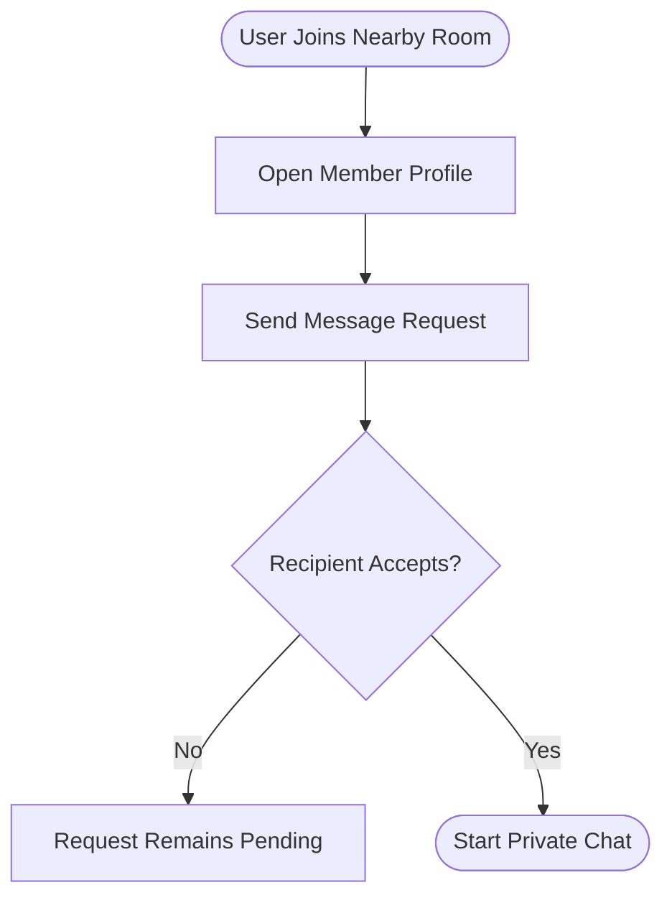

# SpotUs 💥

> **PROPRIETARY & CONFIDENTIAL**  
> This repository contains proprietary code for the **SpotUs** mobile application. Access is restricted to authorized team members only. Any distribution, reproduction, or disclosure without explicit permission is strictly prohibited.

---

## 📋 Project Summary

SpotUs is an internal, location-based social discovery and real-time messaging application. Built on React Native and Expo, SpotUs connects nearby communities through real-time geographic queries, interest-based rooms, moderated conversations, and request-based direct messages.

---

## 📖 Table of Contents

- [Core Philosophy](#-core-philosophy)
- [Key Features](#-key-features)
- [Tech Stack](#%EF%B8%8F-tech-stack)
- [Directory Architecture](#-directory-architecture)
- [Developer Onboarding & Setup](#-developer-onboarding--setup)
  - [Prerequisites](#prerequisites)
  - [SSH Git Clone](#ssh-git-clone)
  - [Environment Configuration](#environment-configuration)
  - [Dependencies Installation](#dependencies-installation)
  - [Local Development Server](#local-development-server)
- [Internal Git & Development Flow](#-internal-git--development-flow)
- [Firebase & Security Configuration](#-firebase--security-configuration)
- [EAS Build & Release Management](#-eas-build--release-management)
- [Confidentiality & Compliance](#-confidentiality--compliance)

---

## 🛡️ Core Philosophy

SpotUs encourages people to meet through shared nearby rooms before moving into private conversations. Direct messages begin with a request that the recipient can accept.

### The Direct Message Flow

To message someone directly:

1. A user joins a local room within their radius.
2. The user opens another member's profile and sends a message request.
3. The recipient accepts the request to begin a private conversation.



---

## ⚡ Key Features

- 📍 **Geohash Location Queries**: Scans active chat rooms in real-time utilizing geo-queries powered by `geofire-common` and a configurable radius slider.
- 💬 **Real-time Pub/Sub Messaging**: Low-latency chat sync powered by Firebase Firestore, complete with typing indicators and read receipts.
- 🔐 **Secure Passwordless Auth**: Clerk Core integration supporting Passwordless OTP, Google OAuth, and Apple Sign-In.
- 🎨 **Sleek Premium Design**: Crafted using NativeWind (Tailwind CSS v3) supporting native dark mode, glassmorphic UI components, sheet menus (`@gorhom/bottom-sheet`), and subtle micro-haptics.
- 📸 **Rich Media Sharing**: Built-in camera, gallery selection, and instant high-speed upload pipeline via Cloudinary.
- 🔔 **Instant Push Notifications**: Native foreground and background notifications powered by Expo Push Notifications.

---

## 🛠️ Tech Stack & Dependencies

- **Core SDK**: Expo SDK v54 (React Native 0.81.x)
- **Routing**: Expo Router (v6/v7 compatible)
- **Styling**: NativeWind v4, Tailwind CSS, Reanimated v4
- **State & Logic**: Context APIs, Lucide Icons, Haptics
- **Identity Provider**: Clerk SDK (`@clerk/expo`)
- **Database Backend**: Firebase Firestore (Web SDK v12)
- **Geo-indexing**: Geohashes via `geofire-common`
- **File Uploads**: Cloudinary Image upload API
- **Push Services**: Expo Notification SDK

---

## 📂 Directory Architecture

```
spotus/
├── app/                      # Expo Router App Entry & Routes
│   ├── index.jsx             # Entry Router gateway
│   ├── welcome.jsx           # Landing / Welcome view
│   ├── (auth)/               # Authentication Sub-router (Login, Sign-Up, OTP)
│   └── (authenticated)/      # Gate-protected Sub-router
│       ├── (tabs)/           # Main App tab-nav (Home, Rooms, Chat lists, Profile)
│       ├── dm/               # Direct message dynamic route ([chatId].jsx)
│       ├── rooms/            # Room dynamic routes ([roomId].jsx, map.jsx)
│       ├── users/            # Profile card routes ([userId].jsx)
│       └── profile/          # Settings, Privacy, Password & Security routes
├── components/               # Reusable Modular UI Components
│   ├── auth/                 # Form inputs and Clerk auth buttons
│   ├── chat/                 # Message bubble feeds, typing indicators
│   ├── rooms/                # Dynamic lists and map sliders
│   └── ui/                   # Headers, loaders, buttons, bottom sheets
├── config/                   # Backend setup files
│   └── firebase.config.js    # Firebase Initializer
├── context/                  # Global contexts (ThemeContext, etc.)
├── hook/                     # Custom React Hooks
├── lib/                      # Core business logic helpers
│   ├── location.js           # Core Location fetchers (Expo Location)
│   ├── getNearbyRoom.js      # Geohash queries for Room collection
│   ├── notification.js       # Push Notification register/send
│   └── uploadCloudinary.js   # Cloudinary file-upload wrappers
├── utils/                    # Global utility functions (clerk storage cache, etc.)
├── app.json                  # Expo configuration properties & plugins
├── eas.json                  # EAS Build definitions (development, apk, production)
└── firestore.rules           # Cloud Firestore Security Rule
```

---

## 🚀 Developer Onboarding & Setup

### Prerequisites

Ensure your workstation has the following installed:

- **Node.js** (v18.x or v20.x LTS recommended)
- **watchman** (`brew install watchman` for macOS users)
- **iOS Simulator** (via Xcode) and/or **Android Emulator** (via Android Studio)
- **Expo Go** app installed on your physical test device

### SSH Git Clone

Request repository access from the administrator, then clone using SSH:

```bash
git clone git@github.com:spotus/spotus.git
cd spotus
```

### Environment Configuration

Copy the template below to create your local environment file. **Never commit `.env` or configuration secrets to the repository.**

```bash
touch .env
```

Add your development keys:

```env
# Clerk Authentication configuration
EXPO_PUBLIC_CLERK_PUBLISHABLE_KEY=pk_test_...

# Firebase Client SDK Configuration
EXPO_PUBLIC_FIREBASE_API_KEY=AIzaSy...
EXPO_PUBLIC_FIREBASE_AUTH_DOMAIN=...
EXPO_PUBLIC_FIREBASE_PROJECT_ID=...
EXPO_PUBLIC_FIREBASE_STORAGE_BUCKET=...
EXPO_PUBLIC_FIREBASE_MESSAGING_SENDER_ID=...
EXPO_PUBLIC_FIREBASE_APP_ID=...
EXPO_PUBLIC_FIREBASE_MEASUREMENT_ID=...
```

### Dependencies Installation

Install dependencies based on the locked package manifests:

```bash
npm ci
```

### Local Development Server

Run the development bundler:

```bash
npm start
```

- Press `i` to launch on the local iOS Simulator.
- Press `a` to launch on the local Android Emulator.
- Scan the console QR code to run on a physical test device via Expo Go.

---

## 🛠️ Internal Git & Development Flow

To maintain codebase sanity, follow these team practices:

1. **Branching Model**:
   - Create feature branches off `main`: `feature/your-feature-name`
   - Create fix branches: `bugfix/issue-description`
2. **Secrets Management**:
   - Do **NOT** commit credentials. Ensure `.env` is listed inside `.gitignore`.
3. **Linting**:
   - Before pushing commits, run the linter to verify formatting:
     ```bash
     npm run lint
     ```

---

## 🔒 Firebase & Security Configuration

SpotUs uses **Clerk** for user authentication instead of Firebase Auth. Because of this, Firebase's `request.auth` remains `null` for client-side API requests.

The firestore security configuration is located in [firestore.rules](file:///Users/kamalahara/code/spotus/firestore.rules).

- **Client Access**: Read/write rules are set up to support real-time messaging updates direct from the client.
- **Moderation**: The `/reports/{reportId}` rules are write-only (`allow create: if true; allow read, update, delete: if false`) to secure reporting logs from external inspects.

---

## 📦 EAS Build & Release Management

We use **Expo Application Services (EAS)** to run builds and distribute internal testing versions.

### Setting Up EAS locally

1. Install EAS CLI: `npm install -g eas-cli`
2. Log in using the team shared account credentials:
   ```bash
   npx eas-cli login
   ```
3. Link the app with the EAS project ID (from `app.json`):
   ```bash
   npx eas project:init
   ```

### Internal Release Builds

Generate builds based on configurations defined in [eas.json](file:///Users/kamalahara/code/spotus/eas.json):

```bash
# Generate a local development client build (allows hot reloading on devices/simulators)
npx eas build --profile development --platform all

# Generate an Android APK for sideloading/manual distributions
npx eas build --profile apk --platform android

# Compile final production bundles
npx eas build --profile production --platform all
```

---

## 🚀 Deployment Status & Next Steps

Based on the recent production readiness audit, SpotUs is currently **Ready for Internal Testing & Closed Beta**. Before proceeding to a Public Beta or Store Launch, the following critical updates must be addressed:

- **Firebase Scaling:** Implement aggressive debounce on Map panning and chat pagination to prevent hitting the Firebase Spark Plan read limits.
- **Store Requirements:** Add an explicit End User License Agreement (EULA) during onboarding emphasizing zero tolerance for abusive content, as required by the App Store for user-generated content apps.
- **Resource Management:** Implement automated cleanup mechanisms (e.g., Cloud Functions) for expired rooms.

---

## ⚠️ Confidentiality & Compliance

This software, its design, structure, and database schemas are the intellectual property of the project owners.

- Access is granted solely under employment or contracting agreements.
- Do not share source code, database structures, security configurations, API secrets, or certificates with third parties.
- Violations of these conditions will result in immediate termination of access and possible legal action.